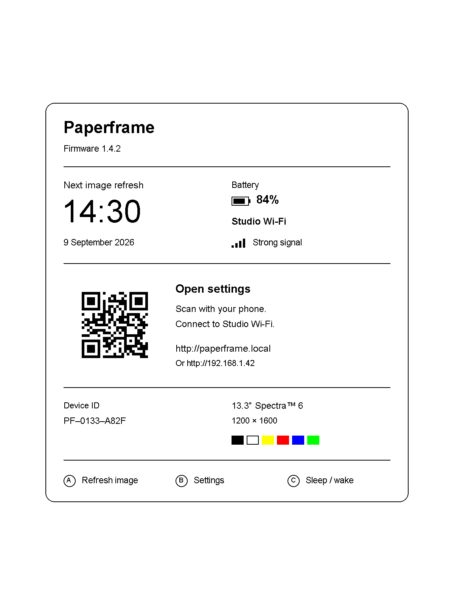
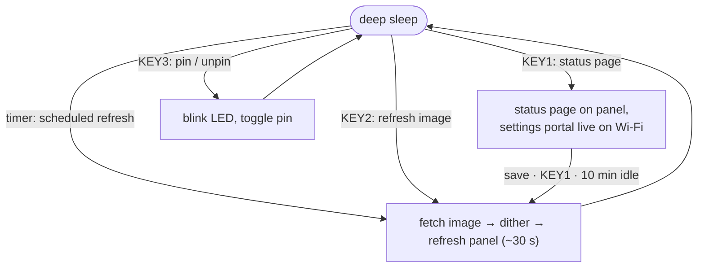

# Paperframe — standalone, zero-cloud firmware for the Seeed Studio XIAO ePaper Display Board (EE02)

[](../../actions/workflows/ci.yml)

One firmware, one board: the **XIAO EE02** (XIAO ESP32-S3 Plus + the
13.3″ Spectra-6 colour panel, 1200×1600, portrait-native).

Seeed ships this board pre-flashed with SenseCraft HMI, a cloud-based
no-code dashboard tool that requires an account and an internet connection to
reconfigure. This firmware needs neither: every setting — refresh interval,
image source, quiet hours, timezone, orientation — is configured from your
phone talking directly to the device over your own Wi-Fi. Nothing else has
to run, ever.



*Design mockup — not a photo of the real panel, which is glossier and
paper-white.*

On a schedule you choose it wakes from deep sleep, fetches an image from a
URL you choose, dithers it to the panel's six-colour palette, refreshes, and
goes back to sleep. Everything is configured **on the device itself** — no
account, no cloud, no companion server. This is a hobby project: support is
best-effort, MIT-licensed, no warranty.

## How it works

The firmware is one loop: sleep, wake for a reason, act, sleep again.



Timer wakes that have nothing to do — the image is pinned, or the wake
lands inside quiet hours — roll straight back to sleep without touching
the panel or the radio.

## Hardware

| Part | Source |
|---|---|
| XIAO ePaper Display Board **EE02** + XIAO ESP32-S3 Plus | Seeed Studio |
| 3.7 V Li-ion battery, JST PH 2.0mm | any (see battery notes) |

The panel is a 13.3″ Spectra-6 (E Ink Gallery) colour e-paper, 1200×1600,
driven at `BOARD_SCREEN_COMBO=510`. Full-panel refresh only (no partial
mode), ~25–30 s per update.

## Buttons

| Silkscreen | GPIO | Function |
|---|---|---|
| KEY1 | 2 | Toggle the full-screen **status page**. While it shows, the **settings portal** is live on your Wi-Fi. |
| KEY2 | 3 | **Refresh the image** now. |
| KEY3 | 5 | **Pin/freeze** the current image — scheduled refreshes pause (and barely sip battery) until pressed again. |
| RESET | — | Hardware reboot (clears boot counter and battery-delta memory). With BOOT held: flashing bootloader. |

Every press is acknowledged by the LED within ~0.5 s (1 blink = refresh
image, 2 = status page, 3 = pin), because the panel itself takes much
longer to change.

## First-time setup

1. Connect the panel's FPC cable, flip the power switch on, plug in USB-C.
2. The panel shows the onboarding screen: scan the QR to join the device's
   hotspot (`Paperframe-Setup`), and the setup page opens by itself
   (http://192.168.4.1 as fallback). Pick your 2.4 GHz network.
3. Credentials persist on-device (NVS). Nothing secret ever enters this repo.

## Settings

Press **KEY1**. The panel shows the status page (next refresh, Wi-Fi,
battery, device details) plus a URL and QR code — open it from any device
on the same Wi-Fi:


| Setting | Choices | Default |
|---|---|---|
| Refresh interval | 15 min – 24 h | 1 h |
| Image source URL | any http(s) URL template | picsum via weserv |
| Paused | pin/freeze (same as KEY3) | off |
| Quiet hours | skip refreshes in a nightly window | off |
| Timezone | auto (IP geolocation) or manual offset | auto |
| Device name | mDNS hostname (`<name>.local`) | `paperframe` |
| Orientation | portrait / landscape, each flippable | portrait |

Settings auto-save per field. The portal stops when you leave the status
page (press KEY1 again or 10 minutes idle) — the device then fetches an
image and sleeps. Transient failures on scheduled refreshes never touch
the panel — the current image stays up and the next wake retries. If saved
Wi-Fi stops working (new router, moved house), the device reopens its
`Paperframe-Setup` hotspot by itself.

### Image source contract

The URL must return a **baseline (non-progressive) JPEG** at the panel
size. Tokens are substituted per fetch:

- `{width}` / `{height}` — panel size after orientation (1200×1600
  portrait or 1600×1200 landscape)
- `{seed}` — random number (cache-buster)

The default goes through images.weserv.nl because picsum serves
progressive JPEGs, which the on-device decoder can't parse; weserv
re-encodes to baseline at exact size. Pointing at your own server or a
static file works — just honor the contract. Please be a good citizen of
free services: one device is nothing, a fleet is not.

## Privacy & security notes

- Image fetches use HTTPS **without certificate validation**
  (`setInsecure()`): an attacker on your network path could substitute
  the image. Accepted trade-off for a photo frame; noted for transparency.
- Timezone auto-detect calls `ip-api.com` over plain HTTP (their free,
  **non-commercial** tier) and reveals your public IP to them. Set a
  manual timezone in the portal to disable it entirely.
- The settings portal is HTTP on your LAN, unauthenticated — anyone on
  your Wi-Fi can change the device's settings. Threat model: roommates.

## Building & flashing

PlatformIO CLI. The display driver is selected entirely by `build_flags`
in `platformio.ini` — never edit library files.

```bash
pio run -e ee02      # build the firmware
pio run -t upload    # flash over USB-C
pio device monitor   # serial at 115200 (USB-CDC)
pio test -e native   # host-side unit tests (no hardware needed)
```

**Dev mode:** plugged into a computer, the board never sleeps —
`pio run -t upload` just works. A USB *host* is detected via the
USB-Serial-JTAG SOF frame counter, so chargers never trigger dev mode.
If it was last running on battery/charger (asleep, USB port gone), wake
it first: press any user button and run the upload within the wake window
(a port-watching loop works well: `until ls /dev/cu.usbmodem* 2>/dev/null;
do sleep 0.2; done; pio run -t upload`), wait for the scheduled self-wake,
or hold **BOOT**, tap **RESET**, release BOOT — then flash and press
RESET after. While plugged in, the settings portal stays reachable at
http://<name>.local the whole time — no KEY1 needed.

While the portal's up (dev mode, or the 10-minute KEY1 status window),
`http://<name>.local/debug` is a full remote-debugging page: the last
fetched image, a live capture of whatever's actually on the panel right
now, a capture of what was on it just before that, and a rolling copy of
the last ~8KB of Serial output — handy when `pio device monitor` isn't
available (e.g. no interactive TTY). Same unauthenticated-on-your-LAN
threat model as the rest of the portal. Each piece is also fetchable on
its own, and the board can be driven remotely too:

| Route | Returns |
|---|---|
| `GET /log` | Plain-text Serial log — first line includes the firmware's git hash (see `docs/versioning.md`) |
| `GET /last.jpg` | The last successfully fetched image (JPEG) |
| `GET /current` | Live capture of the panel right now, full resolution (BMP) |
| `GET /previous` | Capture of the panel just before the most recent redraw, downscaled to a ~400px thumbnail (BMP) |
| `POST /debug/key1` `/key2` `/key3` | Simulate a KEY1/KEY2/KEY3 press (status view, refresh image, pin/freeze) — e.g. `curl -X POST http://<name>.local/debug/key2` |

Plugging in the USB cable is *not* itself a wake source — only
`esp_sleep_enable_timer_wakeup` (the scheduled refresh) and
`esp_sleep_enable_ext1_wakeup` (the three buttons) are armed before deep
sleep (`power.cpp`). If the board was already asleep on battery power when
you plug it in, it stays asleep: `setup()` never re-runs, so the
USB-Serial-JTAG port never enumerates, until the next timer tick or a
button press. The XIAO ESP32-S3's only USB-power signal is the `5V`/VBUS
pin itself (raw 5V, not a logic-level GPIO) — Seeed's own docs note every
GPIO on this board family is already spoken for, so there's no free,
RTC-capable pin to wire up an `ext0` wake on cable insertion without a
hardware mod. Pressing a button after plugging in is the expected way to
get a live port, not a bug.

## Source layout

```
src/config.h      pins, buttons, defaults, panel constants
src/settings.*    runtime configuration (NVS-backed)
src/logic/        pure decision logic — host-testable, no Arduino deps
src/display.*     EPaper object, palette dither, JPEG decode
src/logic/layout_math.h   fixed 12-column status-screen grid
src/net.*         Wi-Fi provisioning (WiFiManager), image fetch, timezone+NTP
src/portal.*      settings web portal (served while the status page shows)
src/portal_html.h embedded HTML for the settings portal
src/power.*       battery ADC + percent curve, LED, deep-sleep entry
src/state.h       shared globals (prefs, pin state)
src/ui.*          wake reason, status page, fetch metadata
src/main.cpp      wake dispatch: which wake does what
test/             native unit tests (pio test -e native)
```

## Hardware notes (hard-won)

- **The Spectra-6 panel is palette-indexed (4 bpp).** `TFT_*` colour
  macros are panel nibbles (WHITE=0x0, GREEN=0x2, RED=0x6, YELLOW=0xB,
  BLUE=0xD, BLACK=0xF) and `drawPixel` stores `color & 0x0F`. Raw RGB565
  pushed via `pushImage` renders garbage — images must be dithered to the
  panel's palette (`src/display.cpp`).
- **Reading pixels back has the same pitfall, mirrored.** `EPaper::readPixel()`
  (from the vendored `TFT_eSPI`) decodes 4bpp storage through a generic
  `_colorMap` this project never populates — it returns self-consistent
  but meaningless colours. Use `display.h`'s `truePixelColor()` instead:
  it reads the raw stored value via `readPixelValue()` and reverse-matches
  it against `display.cpp`'s own `PALETTE` table, the same one
  `ditherToPanel()` writes through. Confirmed the hard way — `/current`
  was pure noise until this fix.
- **Deep sleep floats digital-only pads** — the panel/battery enable lines
  (GPIO43/6) are latched with `gpio_hold_en` before sleeping, released at
  boot. The held/quiet fast path (`quickSleep`) deliberately leaves them
  latched.
- **The TZ environment doesn't survive deep sleep** — it's reapplied from
  the NVS-cached offset at every boot, or non-fetch wakes render UTC.
- **Battery**: charged from USB-C through the board's BQ24070 (~300 mA
  fast charge, ~30 mA precharge below 3 V). Its **8-hour safety timer**
  latches a fault on deeply discharged large packs — both charge LEDs go
  dark and charging stops; unplug/replug USB to resume. The battery
  percent shown is a discharge-curve estimate, not a fuel gauge.
- ADC reads use `analogReadMilliVolts` (eFuse-calibrated); the naive
  `raw/4095*3.3` conversion reads 20–30 % low on the S3.

## License

MIT — see [LICENSE](LICENSE).
